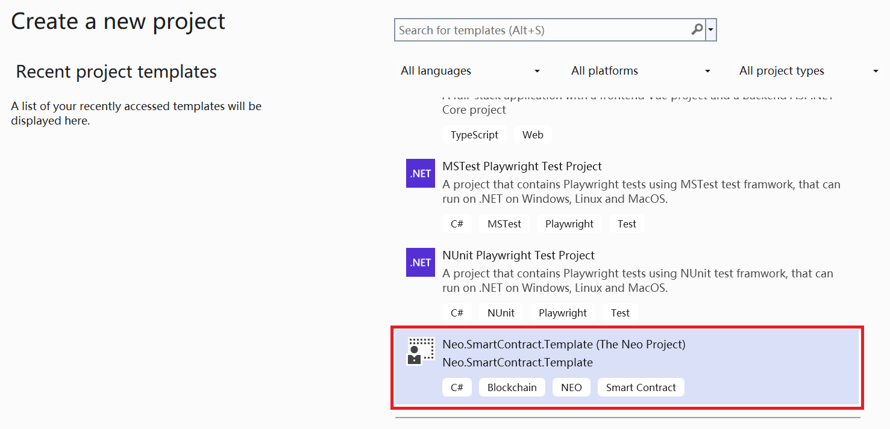

# Using Neo Devpack Dotnet

Designed for developers, Neo Devpack Dotnet is a comprehensive toolkit for creating Neo contracts using .net. It offers convenient contract project templates and a compiler. 

When developing and deploying a contract, the typical process is the following: 

- Installing a project template
- Creating a project using templates
- Writing a contract
- Compiling the contract
- Deploying and testing it

This document covers the usage of project templates and the compiler. For further details on writing and deploying your contract, refer to the subsequent sections.

:::note

- Ensure that you install project templates and compilers with matching or the most recent versions when setting them up.

- If it's been a long while since you last updated your project templates and compiler, make sure to update both when using them again.

:::

## Neo.SmartContract.Template

Neo.SmartContract.Template is a project template used when developing Neo smart contracts. After installing the template, you can create a Neo smart contract project using either the Terminal or Visual Studio.

### Install the template

```
dotnet new install Neo.SmartContract.Template
```

### List all dotnet templates

```
dotnet new list
```

 There are three default templates available after installing Neo.SmartContract: 

- neocontractowner - Standard contract template with Owner, including GetOwner and SetOwner methods)

- neocontractoracle - A contract template using OracleRequest)

- neocontractnep17 - NEP-17 Contract Template, including Mint and Burn methods)

:::note

The `neocontract` template used before has been renamed to `neocontractowner`.

:::

### Uninstall the template

```
dotnet new uninstall Neo.SmartContract.Template
```

### Update the template

```
dotnet new update Neo.SmartContract.Template
```

### Create a project using templates with Terminal

```
dotnet new neocontractowner
```

The project name defaults to the name of the current directory, you can also specify the project name with `-n, --name <name>`, e.g. `dotnet new neocontractowner -n MyFirstContract`.

### Create a project using templates with Visual Studio

In the Visual Studio interface, create a new project, Neo.SmartContract.Template, as shown in the following screenshots:




## Neo.Compiler.CSharp

Neo.Compiler.CSharp (nccs) is the Neo smart contract compiler that compiles the C# language into NeoVM executable OpCodes.

In the project file of the contract project template, you can find the following code, 


```xml
<Target Name="PostBuild" AfterTargets="PostBuildEvent">
    <Message Text="Start NeoContract converter, Source File: $(ProjectPath)" Importance="high"></Message>
    <Exec Command="nccs $(BaseNameArgument) $(NullableArgument) $(CheckedArgument) $(DebugArgument) &quot;$(ProjectPath)&quot;" />
</Target>
```

which is designed to trigger a secondary compilation with `nccs` after a successful C# compilation. This  secondary compilation compiles it to a `nef` file and outputs the `manifest.json` file.

Among them, .nef stands for NEO Executable Format, which mainly contains the contracts's executable code. The specific structure can be found on [GitHub](https://github.com/neo-project/neo/blob/master/src/Neo/SmartContract/NefFile.cs).

manifest.json represents the manifest of a smart contract. When a smart contract is deployed, it must explicitly declare the features and permissions it will use.

When running, it will be restricted by its declared list of features and permissions, and cannot exhibit any behavior outside the scope of the list.

### Install the compiler

```
dotnet tool install --global Neo.Compiler.CSharp
```

### List all dotnet tools

```
dotnet tool list
```

### Uninstall the compiler

```
dotnet tool uninstall --global Neo.Compiler.CSharp
```

### Update the compiler

```
dotnet tool update --global Neo.Compiler.CSharp
```

### Compile the contract file with Terminal

In the Terminal interface, go to the project path and run the following command to build your contract：

```
dotnet build
```

or

```
nccs
```

Related contract files are outputted under `bin\sc` path in the contract project directory.

### Compile the contract file with Visual Studio

In the Visual Studio interface, click Build -> Build Solution (Ctrl + Shift + B).

## Versioning tips

- After successfully creating the project, open it and check if the version of the NuGet package `Neo.SmartContract.Framework` matches the version of `Neo.Compiler.CSharp`. If the compiler is up-to-date but Neo.SmartContract.Framework is not, please manually update it to ensure the proper compilation of the project.

- If you're working on an older contract project, make sure to compile it using the appropriate compiler version.

- If you are updating a contract project that is quite old, ensure that you have upgraded both the NuGet package `Neo.SmartContract.Framework` and the compiler to the latest versions, and also make necessary modifications to the contract code.

- For the most current way of writing contract code, see this document or [GitHub](https://github.com/neo-project/neo-devpack-dotnet/tree/master/examples). Among other things, the example contracts in GitHub may contain code for the upcoming version (unreleased) of the template and compiler.

## References 

[NuGet (Neo.SmartContract.Template)](https://www.nuget.org/packages/Neo.SmartContract.Template)

[NuGet (Neo.Compiler.CSharp)](https://www.nuget.org/packages/Neo.Compiler.CSharp)

[GitHub (Neo-Devpack-Dotnet)](https://github.com/neo-project/neo-devpack-dotnet)

[GitHub (example contracts)](https://github.com/neo-project/neo-devpack-dotnet/tree/master/examples)

Contract template for community maintenance:

- [Neo3.SmartContract.Templates](https://www.nuget.org/packages/Neo3.SmartContract.Templates) by: shuaishuimen

- [NeoEvents.SmartContract.Templates](https://www.nuget.org/packages/NeoEvents.SmartContract.Templates) by: cschuchardt
