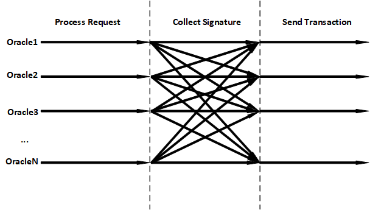
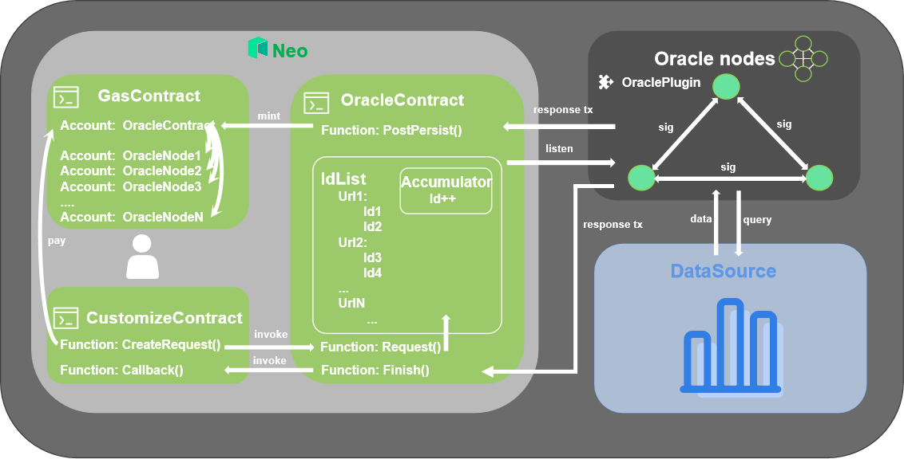

# Neo Oracle 服务

预言机（Oracle）的出现解决了区块链无法向外部网络获取链外信息的问题，作为智能合约与外部世界通信的网关，Oracle 为区块链打开了一扇通往外部世界的窗户。对于链外请求到的数据，Oracle 会通过多方验证来保证结果的准确性，并将结果以交易的形式上链供合约访问。

Neo Oracle Service 是 Neo N3 内置的链外数据访问服务，它允许用户在智能合约中构建对外部数据源的访问请求，并由委员会指定的可信Oracle节点获取数据后，将其传入回调函数中继续执行相关智能合约逻辑。


## 关键机制

### 提交-揭露机制

提交-揭露机制是一个顺序协议，可以避免多个Oracle节点间的数据抄袭问题。

**流程**

1. Oracle节点向其他Oracle节点提交一份有关于数据的密文信息（哈希、签名等）并收集其他Oracle提交的密文信息。

   Neo Oracle Service 使用的是Response交易的多签签名。

2. 收集到足够的密文信息后，Oracle节点将数据向其他Oracle节点揭露用以验证数据。

   Neo Oracle Service 揭露的是Response交易

由于想要抄袭的Oracle节点无法提前预知数据，所以无法提交密文信息，从而避免了抄袭问题。



### 请求/响应模式

Neo Oracle Service采用的是请求/响应模式的处理机制，这是一种异步模型。



**流程**

1. 用户通过自定义智能合约调用Oracle合约的Request方法构建Request请求。

   每个成功创建的Request请求会被分配一个请求编号RequestID，并缓存在Request请求缓存列表中。

2. Oracle节点实时监听Request缓存列表中的访问请求，并根据请求访问相关数据源来获取数据。

3. 用指定的过滤器对获取的数据进行过滤处理，并将处理后的数据封装成一笔Response交易（包含请求编号RequestID、数据、固定调用脚本、多签地址等）。

   Response交易的 TransactionAttribute 部分会附加Request结果数据。交易中的固定调用脚本用于调用 Oracle 合约的 `finish` 方法，从而执行回调函数 `CallbackMethod`。

4. Oracle节点通过提交-揭露机制，与其他Oracle节点一起对Response交易进行多签。

5. 完成多签的Response交易会被上链，并执行相关回调函数的逻辑。

## 协议支持

- **https://**
- **neofs:**

## 收费和激励

- **收费模型**

  用户在使用Neo Oracle Service时需按照Request请求次数进行付费，每个请求的收费单价默认是 0.5 GAS。同时用户还需要支付一笔费用作为回调函数的预付款。这些款项在构建Request就会被扣除。

- **激励模型**

  用户请求Request时支付的费用会在区块后置持久化`PostPersist`时依次分发给Oracle节点。

  分发顺序=RequestID%Oracle个数

## 合约示例

以下是一个调用Oracle 服务的合约示例：

```cs
using Neo.SmartContract;
using Neo.SmartContract.Framework;
using Neo.SmartContract.Framework.Native;
using Neo.SmartContract.Framework.Services;
using System.ComponentModel;

namespace demo
{
    [DisplayName("Oracle Demo")]
    [ManifestExtra("Author", "Neo")]
    [ManifestExtra("Email", "dev@neo.org")]
    [ManifestExtra("Description", "This is a Oracle using template")]
    public class OracleDemo : SmartContract
    {
        static readonly string PreData = "RequstData";

        public static string GetRequstData()
        {
            return Storage.Get(Storage.CurrentContext, PreData);
        }

        public static void CreateRequest(string url, string filter, string callback, byte[] userData, long gasForResponse)
        {
            Oracle.Request(url, filter, callback, userData, gasForResponse);
        }

        public static void Callback(string url, byte[] userData, int code, byte[] result)
        {
            if (Runtime.CallingScriptHash != Oracle.Hash) throw new Exception("Unauthorized!");
            Storage.Put(Storage.CurrentContext, PreData, result.ToByteString());
        }
    }
}
```

如上例所示，该合约包含两个关键函数：

- Request创建函数：用于创建 Oracle Request 请求数据
- Callback回调函数：用于Oracle节点获取数据后执行合约逻辑

### Oracle Request

Oracle Request 请求中需要指定以下字段：

| 字段           | 字节数    | 描述                                                         |
| -------------- | --------- | ------------------------------------------------------------ |
| Url            | string    | 访问资源路径。最大长度为256字节                              |
| Filter         | string    | 过滤器，用于在从数据源返回的结果中过滤出有用信息，其中 Filter 字段为 JSONPath 表达式，最大长度为128字节。Oracle 支持的 Filter 规则请参见后文解释。 |
| CallbackMethod | string    | 回调函数方法名。最大长度为32字节，且不能以“_”开头            |
| UserData       | var bytes | 用户自定义数据                                               |
| GasForResponse | long      | 回调函数执行预付款，用于支付Response交易执行所需的费用。预付款应不小于 0.1 GAS，否则无法发起 Oracle 请求。预付款会在Request构建时自动扣除。 |

#### Url

URL请求需提供JSON格式的数据，对于HTTP请求，服务器必须以 “Content-Type: application/ JSON”  header 回答请求才能成功。

##### NeoFS URLs

NeoFS URLs 格式如下：

```
Copyneofs://<Container-ID>/<Object-ID/<Command>/<Params>
```

其中 `Container-ID` 和 `Object-ID` 是强制参数，`Command` 和 `Params` 为可选。

如果没有任何命令，oracle子系统将获得一个对象并返回其负载，例如： 

```
neofs://C3swfg8MiMJ9bXbeFG6dWJTCoHp9hAEZkHezvbSwK1Cc/3nQH1L8u3eM9jt2mZCs6MyjzdjerdSzBkXCYYj4M4Znk
```

使用命令 `range` 可以获取对象的部分有效载荷，其参数为 "offset|length"，其中 "offset "是指从有效载荷开始跳过的字节数，"length "是指返回给调用者的字节数。

请求示例： 

```
neofs://C3swfg8MiMJ9bXbeFG6dWJTCoHp9hAEZkHezvbSwK1Cc/3nQH1L8u3eM9jt2mZCs6MyjzdjerdSzBkXCYYj4M4Znk/range/42|128
```

使用命令 `header` 可以获取对象的 header。该命令没有参数，如下所示：

```
neofs://C3swfg8MiMJ9bXbeFG6dWJTCoHp9hAEZkHezvbSwK1Cc/3nQH1L8u3eM9jt2mZCs6MyjzdjerdSzBkXCYYj4M4Znk/header
```

使用命令 `hash` 可以获取对象的 SHA256 hash 或部分。该命令有一个可选的范围参数，其语法与 `range` 命令相同。如下所示： 

```
neofs://C3swfg8MiMJ9bXbeFG6dWJTCoHp9hAEZkHezvbSwK1Cc/3nQH1L8u3eM9jt2mZCs6MyjzdjerdSzBkXCYYj4M4Znk/hash
```

#### Filter

这里通过如下 Json 示例来说明 Oracle 支持的 Filter 规则。

```json
{
    "store": {
        "book": [
            {
                "category": "reference",
                "author": "Nigel Rees",
                "title": "Sayings of the Century",
                "price": 8.95
            },
            {
                "category": "fiction",
                "author": "Evelyn Waugh",
                "title": "Sword of Honour",
                "price": 12.99
            },
            {
                "category": "fiction",
                "author": "Herman Melville",
                "title": "Moby Dick",
                "isbn": "0-553-21311-3",
                "price": 8.99
            },
            {
                "category": "fiction",
                "author": "J. R. R. Tolkien",
                "title": "The Lord of the Rings",
                "isbn": "0-395-19395-8",
                "price": 22.99
            }
        ],
        "bicycle": {
            "color": "red",
            "price": 19.95
        }
    },
    "expensive": 10,
    "data": null
}
```

| Filter                                | 返回结果                                   |
| ------------------------------------- | ------------------------------------------ |
| $.store.book[*].author                | 所有图书的作者                             |
| $..author                             | 所有作者                                   |
| $.store.*                             | 所有信息，包括书和自行车                   |
| $.store..price                        | 所有东西的价格                             |
| $..book[2]                            | 第三本书                                   |
| $..book[-2]                           | 倒数第二本书                               |
| $..book[0,1]                          | 前两本书                                   |
| $..book[:2]                           | 从索引0（包含）到索引2（不包含）的所有图书 |
| $..book[1:2]                          | 从索引1（包含）到索引2（不包含）的所有图书 |
| $..book[-2:]                          | 最后两本书                                 |
| $..book[2:]                           | 从尾部开始的第二本书                       |
| $..book[?(@.isbn)]                    | 无效 Filter                                |
| $.store.book[?(@.price < 10)]         | 无效 Filter                                |
| $..book[?(@.price <= $['expensive'])] | 无效 Filter                                |
| $..book[?(@.author =~ /.*REES/i)]     | 无效 Filter                                |
| $..book[(@.length-1)]                 | 无效 Filter                                |
| $..*                                  | 无效 Filter                                |
| $..                                   | 无效 Filter                                |
| $.*                                   | 所有 store 数据和 expensive 数据           |
| empty string                          | 源json数据                                 |

返回结果可在 https://github.com/json-path/JsonPath 查询获得。

### Callback 回调函数

回调函数的形参的参数类型和顺序被严格限定，必须遵守以下规则顺序：

| 字段     | 字节数    | 描述                                      |
| -------- | --------- | ----------------------------------------- |
| Url      | string    | 请求的 Url                                |
| UserData | var bytes | 用户自定义数据                            |
| Code     | byte      | Oracle 响应状态编码，详情请参见Code表格。 |
| Result   | var bytes | 结果数据                                  |

### Code

Code 字段定义了Oracle 响应的状态编码，包括以下几种类型：

| 值     | 名称                   | 说明             | 类型   |
| ------ | ---------------------- | ---------------- | ------ |
| `0x00` | `Success`              | 执行成功         | `byte` |
| `0x10` | `ProtocolNotSupported` | 不支持的协议     | `byte` |
| `0x12` | `ConsensusUnreachable` | 结果共识未达成   | `byte` |
| `0x14` | `NotFound`             | 请求的信息不存在 | `byte` |
| `0x16` | `Timeout`              | 请求超时         | `byte` |
| `0x18` | `Forbidden`            | 请求禁止         | `byte` |
| `0x1a` | `ResponseTooLarge`     | 结果数据大小超限 | `byte` |
| `0x1c` | `InsufficientFunds`    | 执行费用不足     | `byte` |
| `0xff` | `Error`                | 执行错误         | `byte` |

