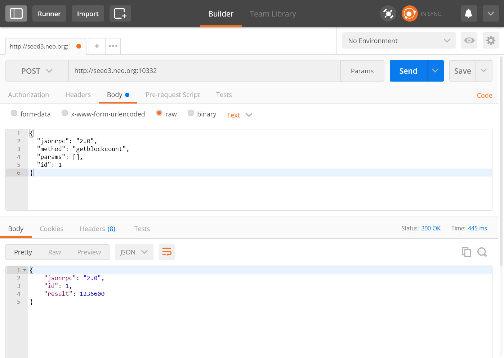

# API 参考

每个 Neo-CLI 节点都可选的提供了一套 API 接口，用于从该节点获取区块链数据，使得开发区块链应用变得十分方便。接口通过 [JSON-RPC](http://wiki.geekdream.com/Specification/json-rpc_2.0.md) 的方式提供，底层使用 HTTP/HTTPS 协议进行通讯。

要启用 RPC服务，你需要安装 [RpcServer 插件](https://github.com/neo-project/neo-modules/releases)，可参考 [安装插件](../../../node/cli/config.md#安装插件) 进行安装。启动 Neo-CLI 时无需添加参数。

:::note
 如果安装时找不到对应版本的文件，则表示当前未发布对应版本的 RpcServer 插件，开发者可以自行编译 [neo-modules](https://github.com/neo-project/neo-modules) 项目:
:::
> 
> 1. 在 neo-cli.dll 所在的目录新建 Plugins 文件夹
> 2. 将编译后的 RpcServer 文件放到 Plugins 文件夹中，然后重新启动 Neo-CLI。

## 监听端口

JSON-RPC 服务器启动后，会监听 TCP 端口，默认为本地地址（127.0.0.1）的 10332 端口，即

```
http://127.0.0.1:10332/
```

如需更改可修改 RpcServer 文件夹中的 config.json 配置文件。

## 命令列表

### 区块链

| 方法                                                    | 参数                         | 说明                                                         |
| ------------------------------------------------------- | ---------------------------- | ------------------------------------------------------------ |
| [getbestblockhash](getbestblockhash.md)             |                              | 获取当前链中高度最大的区块的散列                             |
| [getblock](getblock.md)                             | `\<hash \| index>` [verbose=0] | 根据指定的哈希或索引，返回对应的区块信息                     |
| [getblockcount](getblockcount.md)                   |                              | 获取当前链中区块的数量                                       |
| [getblockhash](getblockhash.md)                     | `\<index>`                     | 根据指定的索引，返回对应区块的散列值                         |
| [getblockheader](getblockheader.md)                 | `\<hash \| index>` [verbose=0] | 根据指定的哈希或索引，返回对应的区块头信息                   |
| [getcommittee](getcommittee.md)                     |                              | 获取委员会成员公钥列表                                       |
| [getnativecontracts](getnativecontracts.md)         |                              | 获得原生合约的列表                                           |
| [getnextblockvalidators](getnextblockvalidators.md) |                              | 获得下个区块的验证人列表                                     |
| [getcontractstate](getcontractstate.md)             | `\<script_hash>`               | 根据合约脚本散列，查询合约信息                               |
| [getrawmempool](getrawmempool.md)                   | [shouldGetUnverified=0]      | 获取内存中已确认的交易列表,如果参数为1，则获取内存中所有的交易列表（包括已确认和未确认交易） |
| [getrawtransaction](getrawtransaction.md)           | `\<txid>` [verbose=0]          | 根据指定的散列值，返回对应的交易信息                         |
| [getstorage](getstorage.md)                         | `\<script_hash>`  `\<key>`       | 根据合约脚本散列和存储的 key，返回存储的 value               |
| [gettransactionheight](gettransactionheight.md)     | `\<txid>`                      | 根据交易哈希获取交易所在的区块高度                           |

### 节点

| 方法                                            | 参数   | 说明                                       |
| ----------------------------------------------- | ------ | ------------------------------------------ |
| [getconnectioncount](getconnectioncount.md) |        | 获取节点当前的连接数                       |
| [getpeers](getpeers.md)                     |        | 获得节点当前已连接/未连接的节点列表      |
| [getversion](getversion.md)                 |        | 获取节点的版本信息                     |
| [sendrawtransaction](sendrawtransaction.md) | `\<hex>` | 广播交易                                   |
| [submitblock](submitblock.md)               | `\<hex>` | 提交新的区块<br/>**注意**：需要成为共识节点 |

### 智能合约

| 方法                                    | 参数                                    | 说明                                           |
| --------------------------------------- | --------------------------------------- | ---------------------------------------------- |
| [getunclaimedgas](getunclaimedgas.md) | `\<address>` | 查询指定地址未获取的 gas |
| [invokefunction](invokefunction.md) | `\<script_hash>`  `\<operation>`  \[params] \[sender] \[signers] | 用指定的哈希调用智能合约，传入方法名及参数 |
| [invokescript](invokescript.md)     | `\<script>` \[sender] \[signers]                | 通过虚拟机运行脚本并返回结果                   |

### 工具

| 方法                                      | 参数       | 说明                          |
| ----------------------------------------- | ---------- | ----------------------------- |
| [listplugins](listplugins.md)         |            | 列出节点已加载的所有插件      |
| [validateaddress](validateaddress.md) | `\<address>` | 验证地址是否是正确的 Neo 地址 |

### 钱包

| 方法                                       | 参数                                       | 说明                           |
| ---------------------------------------- | ---------------------------------------- | ---------------------------- |
| [calculatenetworkfee](calculatenetworkfee.md) | `\<key>` | 计算指定交易的网络费GasToken |
| [closewallet](closewallet.md) |  | 关闭当前打开着的钱包 |
| [dumpprivkey](dumpprivkey.md) | `\<address>`                              | 导出指定地址的私钥 |
| [getnewaddress](getnewaddress.md) |  | 创建一个新的地址 |
| [getwalletbalance](getwalletbalance.md) | `\<asset_id>` | 查询资产余额 |
| [getwalletunclaimedgas](getwalletunclaimedgas.md) |  | 显示钱包中未提取的 GasToken 数量 |
| [importprivkey](importprivkey.md) | `\<key>` | 导入私钥到钱包 |
| [invokecontractverify](invokecontractverify.md) | `\<script_hash>`   \[params] \[signers] | 调用合约的验证方法 |
| [listaddress](listaddress.md) |  | 列出当前钱包内的所有地址 |
| [openwallet](openwallet.md) | `\<path>` `\<password>` | 打开指定钱包，为了安全该方法默认禁用 |
| [sendfrom](sendfrom.md) | `\<asset_id>``\<from>``\<to>``\<value>` | 从指定地址，向指定地址转账 |
| [sendmany](sendmany.md) | `\<outputs_array>` \[signers] | 在一笔交易中向多个地址发起多笔转账 |
| [sendtoaddress](sendtoaddress.md) | `\<asset_id>``\<address>``\<value>` \[signers]| 向指定地址转账 |

### ApplicationLogs 插件

| 方法                                          | 参数    | 说明                                  |
| --------------------------------------------- | ------- | ------------------------------------- |
| [getapplicationlog](getapplicationlog.md) | `\<txid>` | 根据交易 txid 获取合约的事件信息 |

### TokensTracker 插件

| 方法                                            | 参数                       | 说明                                |
| ----------------------------------------------- | -------------------------- | ----------------------------------- |
| [getnep11balances](getnep11balances.md)     | `\<address>`                 | 返回指定地址内的所有 NEP11 资产余额 |
| [getnep11properties](getnep11properties.md) | `\<contract_hash>``\<tokenId>` | 返回 NEP-11 资产的自定义属性        |
| [getnep11transfers](getnep17transfers.md)   | `\<address>`[timestamp]      | 返回指定地址内的所有 NEP11 交易记录 |
| [getnep17balances](getnep17balances.md)     | `\<address>`                 | 返回指定地址内的所有 NEP17 资产余额 |
| [getnep17transfers](getnep17transfers.md)   | `\<address>`[timestamp]      | 返回指定地址内的所有 NEP17 交易记录 |

### StateService 插件

| 方法                                    | 参数                           | 说明                                                        |
| --------------------------------------- | ------------------------------ | ----------------------------------------------------------- |
| [getstateroot](getstateroot.md)     | `\<index>`                       | 通过高度查询 state root。                                   |
| [getproof](getproof.md)             | `\<roothash>``\<scripthash>``\<key>` | 通过 root hash，合约 hash 和 storage key 查询得到 proof。   |
| [verifyproof](verifyproof.md)       | `\<roothash>``\<proof>`            | 使用 root hash 和 proof 进行验证，得到 key 对应存储区的值。 |
| [getstateheight](getstateheight.md) |                                | 查询 stateroot 高度。 |
| [getstate](getstate.md)       | `\<roothash>``\<scripthash>``\<key>`           | 通过 root hash，合约 hash 和 storage key 查询 state。 |
| [findstates](findstates.md)       | `\<roothash>``\<scripthash>``\<prefix>` [key] [count]          | 通过 root hash，合约 hash 和 storage key 的前缀查询 state。 |

:::note
 RPC 中所有的金额（手续费、NEP-17 余额、钱包余额、转账金额等）相关的返回值均为无符号整数，通过 [RpcClient](https://github.com/neo-project/neo-modules/tree/master/src/RpcClient)（C# 轻节点 SDK） 请求时会自动根据资产精度自动换算。若开发者自行编写代码请求，则需要手动对返回值的精度进行处理。例如，返回值为 1234560，资产精度为 8，则实际金额为 0.0123456。
:::

## GET 请求示例

一次典型的 JSON-RPC GET 请求格式如下：

下面以获取当前链中区块的数量方法为例。

请求 URL：

```
http://127.0.0.1:10332?jsonrpc=2.0&method=getblockcount&params=[]&id=1
```

发送请求后，将会得到如下的响应：

```json
{
  "jsonrpc": "2.0",
  "id": 1,
  "result": 909129
}
```

## POST 请求示例

一次典型的 JSON-RPC Post 请求的格式如下：

下面以获取当前链中区块的数量方法为例。

请求 URL：

```
http://127.0.0.1:10332
```

请求 Body：

```json
{
  "jsonrpc": "2.0",
  "method": "getblockcount",
  "params": [],
  "id": 1
}
```

发送请求后，将会得到如下的响应：

```json
{
  "jsonrpc": "2.0",
  "id": 1,
  "result": 909122
}
```

:::note
 请将区块同步到最新高度后再使用 API，否则返回的结果可能不是最新的。
:::

## 测试工具

你可以用 [Postman](https://www.postman.com/) 来方便地进行测试，下面是测试截图：



